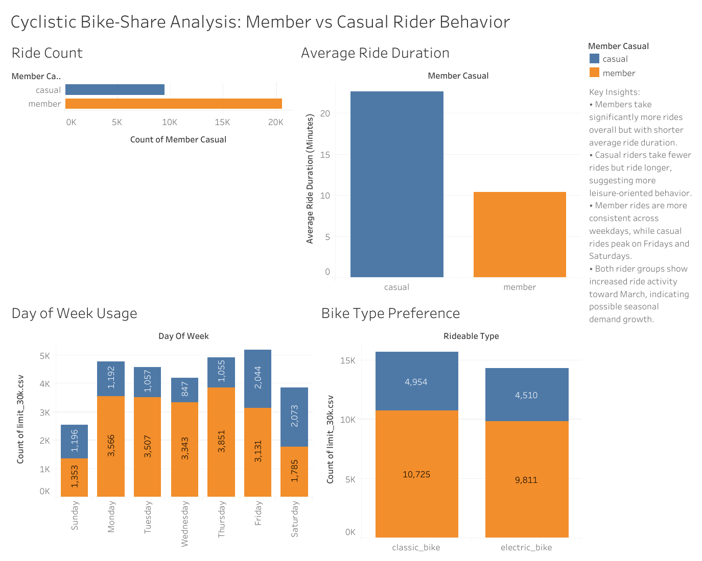

# 🚴 Cyclistic Bike-Share Analysis


## 📌 Executive Summary

This project analyzes **420,649 historical bike-share trips** to understand behavioral differences between **annual members** and **casual riders**.

Using **Google BigQuery (SQL)**, the data was cleaned, transformed, and analyzed before being visualized in **Tableau**. The findings were translated into business recommendations aimed at increasing annual memberships.

---

# 📖 Table of Contents

- [Business Problem](#-business-problem)
- [Project Objectives](#-project-objectives)
- [Dataset](#-dataset)
- [Tools Used](#-tools-used)
- [Project Workflow](#-project-workflow)
- [Data Cleaning](#-data-cleaning)
- [Exploratory Data Analysis](#-exploratory-data-analysis)
- [Dashboard](#-dashboard)
- [Key Findings](#-key-findings)
- [Business Recommendations](#-business-recommendations)
- [Repository Structure](#-repository-structure)
- [Skills Demonstrated](#-skills-demonstrated)

---

# 🎯 Business Problem

Cyclistic's marketing team aims to increase the number of annual memberships.

This analysis answers the following business question:

> **How do annual members and casual riders use Cyclistic bikes differently?**

---

# 🎯 Project Objectives

- Clean and prepare raw trip data
- Analyze riding behaviour
- Compare annual members with casual riders
- Build an interactive Tableau dashboard
- Deliver business recommendations using data

---

# 📂 Dataset

| Item | Details |
|------|---------|
| Dataset | Cyclistic Bike Share Trips |
| Source | Divvy Bike Share (Google Data Analytics Capstone) |
| Records Analyzed | **420,649 rides** |
| Storage | Google BigQuery |

> **Note:** The dataset is provided for educational purposes through the Google Data Analytics Professional Certificate.

---

# 🛠 Tools Used

| Tool | Purpose |
|------|---------|
| Google BigQuery | Data Storage & SQL Analysis |
| SQL | Data Cleaning & Analysis |
| Tableau | Dashboard & Visualization |
| GitHub | Version Control & Documentation |

---

# 🔄 Project Workflow

```text
Raw Data
     │
     ▼
Data Cleaning (SQL)
     │
     ▼
Feature Engineering
     │
     ▼
Exploratory Data Analysis
     │
     ▼
Tableau Dashboard
     │
     ▼
Business Recommendations
```

---

# 🧹 Data Cleaning

The following transformations were performed in BigQuery:

- Combined multiple monthly datasets
- Removed invalid ride durations
- Removed incomplete records
- Removed missing rider categories
- Created ride duration (minutes)
- Extracted weekday
- Extracted ride month
- Prepared a clean analytical dataset for Tableau

---

# 📊 Exploratory Data Analysis

The analysis focused on answering the following questions:

- How many rides were taken by each rider type?
- Do casual riders travel longer distances?
- Which weekdays are busiest?
- Which bike types are preferred?
- How does ride activity change by month?

---

# 📈 Dashboard



📄 **SQL Script:** [cyclistic_analysis.sql](SQL/cyclistic_analysis.sql)

📊 **Tableau Workbook:** [cyclistic_dashboard.twbx](Dashboard/cyclistic_dashboard.twbx)
```

---

# 🔍 Key Findings

## 1️⃣ Members Ride More Frequently

| Rider Type | Total Rides |
|------------|------------:|
| Member | **322,234** |
| Casual | **98,415** |

Members account for the majority of trips, indicating consistent usage throughout the observed period.

---

## 2️⃣ Casual Riders Take Longer Trips

| Rider Type | Average Ride Duration |
|------------|----------------------:|
| Member | **9.98 minutes** |
| Casual | **16.80 minutes** |

Casual riders spend significantly more time per ride, suggesting leisure-oriented usage.

---

## 3️⃣ Riding Behaviour Differs by Day

- Members ride consistently during weekdays.
- Casual riders peak on **Fridays** and **Saturdays**.
- Weekend activity is substantially higher among casual riders.

---

## 4️⃣ Bike Preference

| Rider Type | Most Used Bike |
|------------|----------------|
| Member | Classic Bike |
| Casual | Electric Bike (slightly higher usage) |

Casual riders spend considerably longer riding classic bikes despite a slight preference for electric bikes.

---

## 5️⃣ Monthly Trend

Ride activity increased steadily from **January through March** for both rider groups, indicating seasonal demand growth.

---

# 💡 Business Recommendations

Based on the analysis:

- Promote annual memberships during weekend peaks.
- Highlight long-term savings of membership plans.
- Launch commuter-focused membership campaigns.
- Introduce seasonal promotions before peak riding months.
- Target frequent casual riders with personalized offers.

---

# 📁 Repository Structure

```text
cyclistic-bike-share-analysis/
│
├── README.md
├── SQL/
│   └── cyclistic_analysis.sql
│
├── Dashboard/
│   └── cyclistic_dashboard.twbx
│
├── Images/
│   └── dashboard.png
│
└── LICENSE
```

---

# 🚀 Skills Demonstrated

- SQL
- Google BigQuery
- Data Cleaning
- Data Transformation
- Exploratory Data Analysis (EDA)
- Data Visualization
- Tableau Dashboard Development
- Data Storytelling
- Business Intelligence
- Business Recommendations

---

## 👤 Author

**Halartha**

GitHub: https://github.com/halartha483-cmyk

---

⭐ If you found this project interesting, feel free to explore the repository and connect with me.
